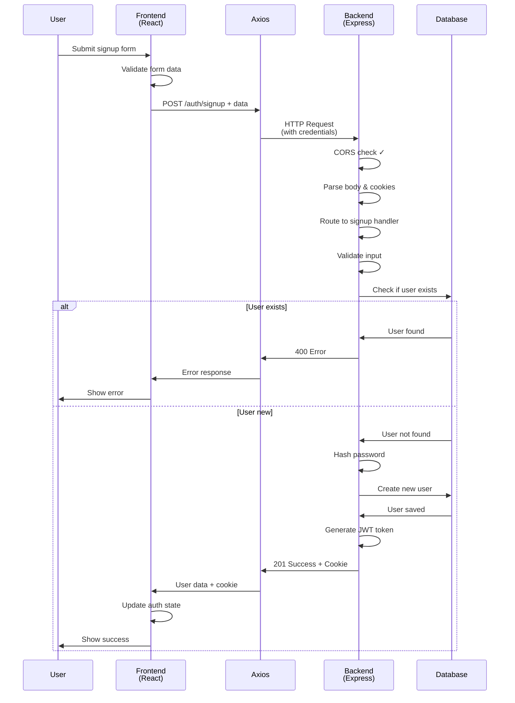

# Chat Application

A full-stack real-time chat application built with React, Node.js, Express, and MongoDB.

## Project Structure

```
Chat Application/
├── backend/          # Express.js backend server
├── frontend/         # React.js frontend application
└── README.md        # This file
```

## Signup Flow Sequence Diagram

### Detailed Sequence Diagram


### Simplified High-Level Flow



## Flow Description

### 1. User Interaction
- User fills out the signup form with `fullName`, `email`, and `password`
- Clicks the "Create Account" button

### 2. Frontend Processing
- **SignUpPage.jsx**: Form submission handler validates data and calls the signup function
- **UseAuthStore.js**: Zustand store manages authentication state and makes API calls
- **axios.js**: Configured axios instance with baseURL and credentials

### 3. HTTP Request
- POST request to `http://localhost:3000/api/auth/signup`
- Request body contains user data
- Credentials (cookies) are included via `withCredentials: true`

### 4. Backend Processing
- **CORS Middleware**: Validates origin and allows cross-origin requests
- **Cookie Parser**: Extracts cookies from request
- **Body Parser**: Parses JSON request body
- **Route Handler**: Routes to `/api/auth/signup` endpoint
- **Controller**: Validates input, checks for existing user, creates new user

### 5. Database Operations
- Check if user with email already exists
- Hash password using bcrypt
- Save new user to MongoDB
- Generate JWT token and set as HTTP-only cookie

### 6. Response & State Update
- Backend returns user data (without password)
- Frontend updates authentication state
- User is now authenticated and can access protected routes

## Key Components

### Frontend
- **SignUpPage.jsx**: Signup form component
- **UseAuthStore.js**: Zustand store for state management
- **axios.js**: HTTP client configuration

### Backend
- **server.js**: Express server setup with CORS and middleware
- **auth.route.js**: Authentication routes
- **auth.controller.js**: Signup business logic
- **auth.middleware.js**: JWT token verification

## Error Handling

The flow includes error handling for:
- **CORS failures**: Request blocked by browser
- **Validation errors**: Invalid input data
- **Duplicate users**: Email already registered
- **Network errors**: Backend unavailable
- **Server errors**: Internal server issues

## Authentication

- JWT tokens are stored as HTTP-only cookies
- Tokens are automatically sent with subsequent requests
- Protected routes verify tokens via middleware
