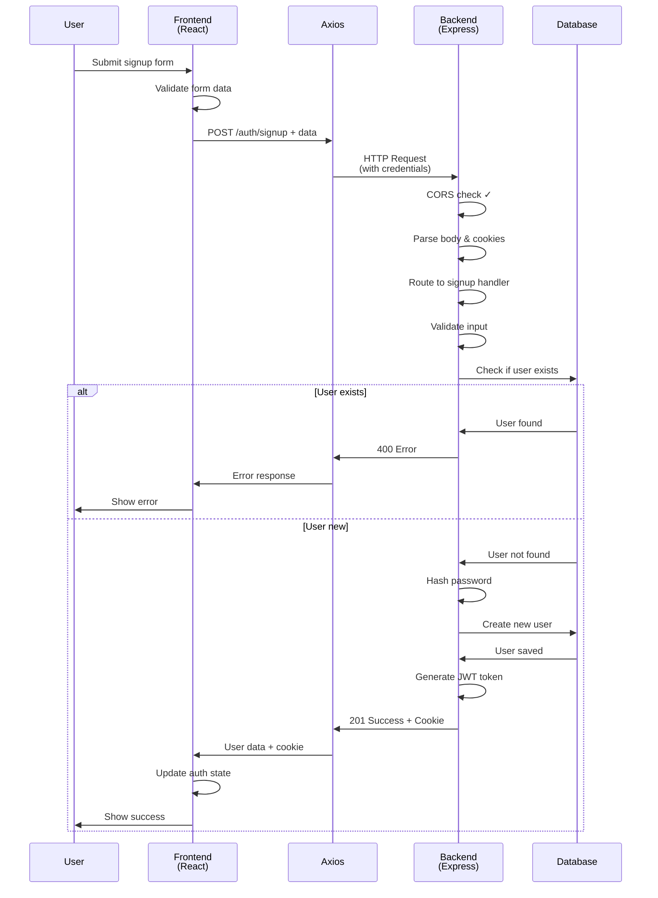
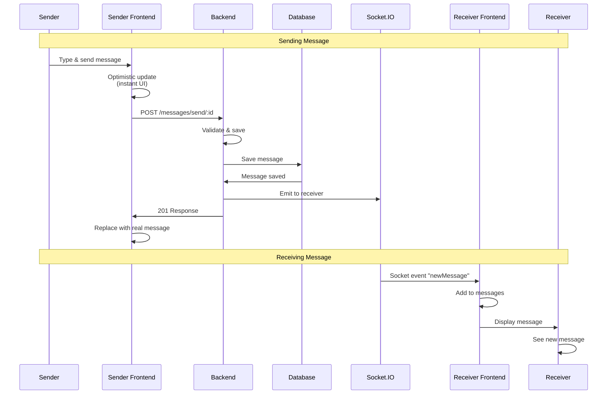

# Chat Application

A full-stack real-time chat application built with React, Node.js, Express, and MongoDB.

## Project Structure

```
Chat Application/
├── backend/          # Express.js backend server
├── frontend/         # React.js frontend application
└── README.md        # This file
```

## Signup Flow Sequence Diagram

### Detailed Sequence Diagram


### Simplified High-Level Flow



## Flow Description

### 1. User Interaction
- User fills out the signup form with `fullName`, `email`, and `password`
- Clicks the "Create Account" button

### 2. Frontend Processing
- **SignUpPage.jsx**: Form submission handler validates data and calls the signup function
- **UseAuthStore.js**: Zustand store manages authentication state and makes API calls
- **axios.js**: Configured axios instance with baseURL and credentials

### 3. HTTP Request
- POST request to `http://localhost:3000/api/auth/signup`
- Request body contains user data
- Credentials (cookies) are included via `withCredentials: true`

### 4. Backend Processing
- **CORS Middleware**: Validates origin and allows cross-origin requests
- **Cookie Parser**: Extracts cookies from request
- **Body Parser**: Parses JSON request body
- **Route Handler**: Routes to `/api/auth/signup` endpoint
- **Controller**: Validates input, checks for existing user, creates new user

### 5. Database Operations
- Check if user with email already exists
- Hash password using bcrypt
- Save new user to MongoDB
- Generate JWT token and set as HTTP-only cookie

### 6. Response & State Update
- Backend returns user data (without password)
- Frontend updates authentication state
- User is now authenticated and can access protected routes

## Key Components

### Frontend
- **SignUpPage.jsx**: Signup form component
- **UseAuthStore.js**: Zustand store for state management
- **axios.js**: HTTP client configuration

### Backend
- **server.js**: Express server setup with CORS and middleware
- **auth.route.js**: Authentication routes
- **auth.controller.js**: Signup business logic
- **auth.middleware.js**: JWT token verification

## Error Handling

The flow includes error handling for:
- **CORS failures**: Request blocked by browser
- **Validation errors**: Invalid input data
- **Duplicate users**: Email already registered
- **Network errors**: Backend unavailable
- **Server errors**: Internal server issues

## Authentication

- JWT tokens are stored as HTTP-only cookies
- Tokens are automatically sent with subsequent requests
- Protected routes verify tokens via middleware

## Message Sending and Receiving Flow

### Detailed Sequence Diagram


### Simplified High-Level Flow



### Flow Description

#### 1. Sender Side - Message Composition
- **MessageInput.jsx**: User types message or selects image
- Form validation ensures text or image is provided
- On submit, calls `sendMessage()` from `useChatStore`

#### 2. Optimistic Update
- **useChatStore**: Immediately creates a temporary message with a temp ID
- UI updates instantly, showing the message to the sender
- Provides instant feedback while waiting for server response

#### 3. HTTP Request to Backend
- POST request to `/api/messages/send/:receiverId`
- Includes JWT cookie for authentication
- Request body contains `{text, image}`

#### 4. Backend Processing
- **Auth Middleware**: Verifies JWT token
- **Message Controller**: Validates input (text or image required)
- Checks receiver exists and is not the same as sender
- If image provided, uploads to Cloudinary
- Creates and saves message to MongoDB

#### 5. Real-Time Delivery via Socket.IO
- Backend looks up receiver's socket ID from `userSocketMap`
- If receiver is online, emits `"newMessage"` event via Socket.IO
- If receiver is offline, message is saved and will be retrieved when they come online

#### 6. Receiver Side - Real-Time Update
- **Socket Connection**: Established when user logs in or opens chat
- **subscribeToMessages()**: Sets up listener for `"newMessage"` events
- When message arrives, validates it's for the current conversation
- Checks for duplicates to prevent duplicate messages
- Updates messages array, triggering UI re-render
- Plays notification sound if enabled

#### 7. Message Persistence
- All messages are saved to MongoDB
- When user opens a conversation, `getMessagesByUserId()` fetches all historical messages
- Messages are displayed in chronological order

### Key Components

#### Frontend
- **MessageInput.jsx**: Message composition component
- **useChatStore.js**: Zustand store managing messages and real-time subscriptions
- **ChatContainer.jsx**: Displays messages and handles socket subscriptions
- **UseAuthStore.js**: Manages socket connection

#### Backend
- **message.controller.js**: Handles message sending, validation, and database operations
- **message.route.js**: Routes for message endpoints
- **socket.js**: Socket.IO server setup and user socket mapping
- **cloudinary.js**: Image upload service

### Real-Time Features

1. **Optimistic Updates**: Instant UI feedback for sender
2. **Socket.IO Integration**: Real-time message delivery to online users
3. **Offline Support**: Messages saved to database for offline users
4. **Duplicate Prevention**: Checks prevent duplicate messages in UI
5. **Sound Notifications**: Optional audio notifications for new messages

### Error Handling

The flow includes error handling for:
- **Validation errors**: Missing text/image, sending to self
- **Receiver not found**: Invalid receiver ID
- **Network errors**: Backend unavailable, socket disconnection
- **Image upload failures**: Cloudinary upload errors
- **Optimistic update rollback**: Removes temporary message on failure
